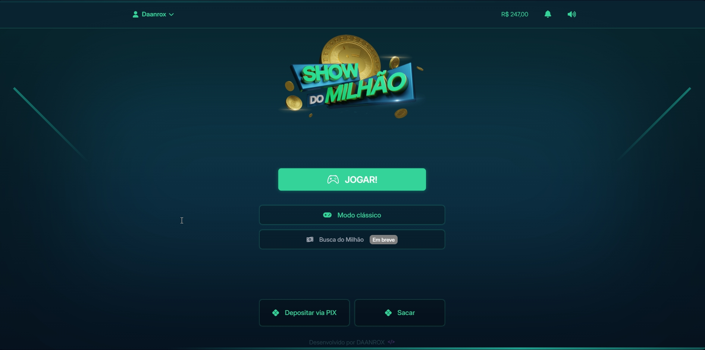

  <h1>✨ Projeto Concluído com Sucesso! 🎉</h1>

# Show do Milhão
  <h2>Sobre o Projeto</h2>

Site de perguntas e respostas onde o usuário poderá depositar, jogar e sacar seus ganhos na plataforma!
Baseado no estilo do Show do Milhão, essa aplicação conta com perguntas dinâmicas, animações e efeitos de audio com as vozes do Silvio Santos.

Para um melhor desempenho, e segurança utilize a hospedagem na Hostinger através deste link: [https://hostinger.com.br](https://hostinger.com.br?REFERRALCODE=xjhowx)

### Deploy
Aplicação em produção [https://showdomilhao.com.br](https://#.com)

 <a href="https://site-00-jhow-tattoos.vercel.app" target="_blank" rel="noreferrer">Demo do projeto</a>
  

  
  
  
  
  

## Contato
<!-- Contato -->
<section>
  <h2>Conecte-se Comigo!</h2>
  

    
    
    
    
    
  

  
<a href="#topo">Para o topo</a>

</section>